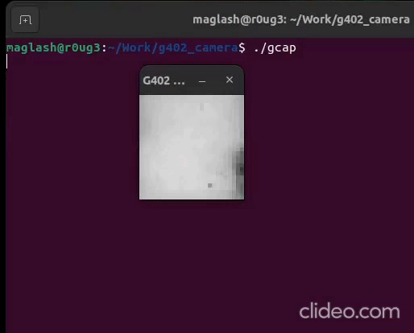

# g402_camera
Turns a Logitech G402 Mouse into a Camera!

Ever wanted to know what the optical sensor in your mouse see?

Here i hacked a Logitech G402 Gaming mouse and uploaded my own firmware to grab pixels off the
sensor and send them over usb to a linux machine, where a sdl2 program renders it on screen!

To replicate this for yourself, you need
    1) A logitech G402 lying around that you dont care about(will be destroyed..kindof..you can actually make it into a mouse again)
    2) A stlink-v2 clone.. to reprogram the STM32 onboard the mouse.
    3) have sdl2 installed in your system for the GUI application to successfuly compile.

The logitech-g402 directory contains the actual STM32CubeMX project, if you want to read the code you can.. else you just need to flash the logitech-g402.bin file under Debug
to the mouse.

Then you need to build the usbd kernel module under usbd_driver.. just do ```sudo make ``` 
Then you need to load this module into the the kernel by ```sudo insmod usbd.ko```
Then you can plug in the mouse into your PC.
After that you need to set permissions for our device file by doing ```sudo chmod 777 /dev/usbd```
After that you can build g402_capture.cpp and run it by doing ```make g402_capture && ./gcap```

And then BOOM! and the FPS is a lot faster than shown in the GIF.. ;)

